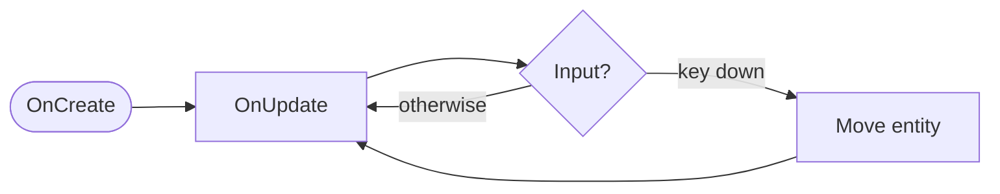

# Documentation Example

A reference page that exercises **every formatting feature** enabled on this site. Use it
as a copy-paste cheat sheet when writing guides. View source for the exact Markdown.

[Getting started](getting-started/index.md){ .md-button .md-button--primary }
[API reference](api/index.md){ .md-button }

---

## Headings

The page title above is an `h1`. Section headings (`h2`) appear in the right-hand table of
contents; sub-headings nest under them.

### Heading level 3
#### Heading level 4
##### Heading level 5
###### Heading level 6

## Inline text

Regular text with **bold**, *italic*, ***bold italic***, ~~strikethrough~~, ==highlighted==,
^^inserted^^, and `inline code`. Subscripts like H~2~O and superscripts like a^2^ + b^2^ = c^2^.

A link to the [Entity reference](api/scene/entity.md), an external link to
[Material for MkDocs](https://squidfunk.github.io/mkdocs-material/), and an autolink:
<https://luckyrobots.com>.

Press ++ctrl+c++ to copy and ++ctrl+shift+v++ to paste. On macOS that's ++cmd+c++.

Abbreviations show a tooltip on hover: the API is built on an ECS.

Inline code with syntax highlighting: `#!csharp Entity player = Entity.FindEntityByTag("Player");`

Icons and emoji: :material-robot:{ .lg } :material-rocket-launch: :octicons-cpu-16:
:material-heart:{ style="color: #f5503d" } and :rocket: :tada: :smile:.

## Lists

### Unordered & nested

- Scene graph
    - Entities
        - Components
    - Prefabs
- Math
- Physics

### Ordered

1. Derive a class from `Entity`.
2. Override a lifecycle method.
3. Attach the script to an entity.

### Task list

- [x] Generate the API reference
- [x] Apply the brand theme
- [ ] Backfill `///` doc comments
- [ ] Publish to GitHub Pages

### Definition list

`Entity`
:   The base class for all scripts; override its lifecycle methods.

`Component`
:   Data and behavior attached to an entity, retrieved with `GetComponent<T>()`.

## Blockquote

> Components hold the data; entities tie them together; scripts give them behavior.
>
> — The scripting model

## Admonitions

Every type, with a custom title:

!!! note "Note"
    General information worth calling out.

!!! abstract "Abstract / Summary"
    A high-level overview of what follows.

!!! info "Info"
    Neutral, supplementary detail.

!!! tip "Tip"
    A helpful suggestion or best practice.

!!! success "Success"
    Something completed or passing.

!!! question "Question"
    A frequently asked question.

!!! warning "Warning"
    Be careful — this needs attention.

!!! failure "Failure"
    Something did not work.

!!! danger "Danger"
    Critical: this can break things.

!!! bug "Bug"
    A known issue or gotcha.

!!! example "Example"
    A worked example follows.

!!! quote "Quote"
    A cited passage.

A title-less admonition and a collapsible one:

!!! tip
    With no title argument, the type name is used as the heading.

??? note "Collapsible (click to expand)"
    Use `???` for a collapsed block and `???+` for one that starts open.

???+ warning "Collapsible, open by default"
    This starts expanded.

## Code blocks

Plain fenced block:

```
No language — rendered as plain monospace.
```

With a language, title, line numbers, and highlighted lines:

```csharp title="Spinner.cs" linenums="1" hl_lines="7 8"
using Hazel;

public class Spinner : Entity
{
    public float DegreesPerSecond = 90.0f;

    protected override void OnUpdate(float ts)
    {
        Rotation += new Vector3(0.0f, DegreesPerSecond * Mathf.Deg2Rad * ts, 0.0f);
    }
}
```

Other languages:

```python
import luckyrobots as lr
session = lr.connect()
```

```bash
mkdocs serve
```

```json
{ "version": "2026.1", "aliases": ["latest"] }
```

### Code annotations

``` { .csharp .annotate }
protected override void OnCreate()
{
    CollisionBeginEvent += other => Log.Info(other.Tag); // (1)!
}
```

1.  Annotations let you attach explanatory notes to specific lines — click the :material-plus-circle: marker.

## Content tabs

=== "C#"

    ```csharp
    Log.Info("Hello from C#");
    ```

=== "Python"

    ```python
    print("Hello from Python")
    ```

=== "Notes"

    Tabs can hold **any** content — prose, lists, admonitions:

    !!! tip "Inside a tab"
        Admonitions nest inside tabs just fine.

## Tables

| Component | Purpose | Common members |
|:----------|:--------|---------------:|
| `TransformComponent` | Position / rotation / scale | `Translation` |
| `RigidBodyComponent`  | Dynamic physics body        | `AddForce` |
| `CameraComponent`     | Render viewpoint            | `FieldOfView` |

(Columns above are left-, left-, and right-aligned.)

## Diagram (Mermaid)



## Buttons

[Primary action](getting-started/index.md){ .md-button .md-button--primary }
[Secondary action](guides/index.md){ .md-button }

## Tracked changes (critic markup)

The robot moved {--slowly--} {++swiftly++} toward the goal.
You can {~~replace this~>with that~~}, {==mark a passage==}, or leave a {>>side comment<<}.

## Footnotes

Scripts run on the simulation thread[^thread], not a background worker.

[^thread]: Lifecycle callbacks like `OnUpdate` are invoked on the engine's main update loop; avoid blocking them.

## Grid of cards

<div class="grid cards" markdown>

-   :material-rocket-launch: **Get started**

    Your first `Entity` script in a few lines.

    [:octicons-arrow-right-24: Getting started](getting-started/index.md)

-   :material-api: **API reference**

    Every public type in the `Hazel` namespace.

    [:octicons-arrow-right-24: Reference](api/index.md)

</div>

---

That's the full toolbox. If a feature you need isn't here, it can be enabled in
`mkdocs.yml` under `markdown_extensions`.

*[API]: Application Programming Interface
*[ECS]: Entity Component System
