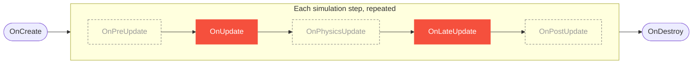

# Entity Lifecycle

Scripts override the `protected virtual` methods on [`Entity`](../api/scene/entity.md) to
hook into the simulation. Only the needed methods require overriding. The base
implementations are empty.



`OnCreate` runs once, the per-step callbacks repeat every simulation step, and `OnDestroy`
runs once at the end. Solid nodes are enabled by default. Dashed nodes are disabled until
turned on.

## Creation and destruction

| Callback | When |
|----------|------|
| [`OnCreate()`](../api/scene/entity.md#m-oncreate)   | Runs once when the entity's script starts. Intended for caching components and initializing state. |
| [`OnDestroy()`](../api/scene/entity.md#m-ondestroy) | Runs once when the entity is destroyed. Intended for releasing allocated resources. |

## Events

`Entity` exposes events that can be subscribed to, typically in `OnCreate`:

```csharp
protected override void OnCreate()
{
    CollisionBeginEvent += other => Log.Info($"Hit {other.Tag}");
}
```

| Event | Fires when |
|-------|------------|
| `CollisionBeginEvent` / `CollisionEndEvent` | a 3D collision starts or ends |
| `TriggerBeginEvent` / `TriggerEndEvent`     | a trigger volume is entered or left |
| `DestroyedEvent`                            | the entity is destroyed |

The [`Entity` reference](../api/scene/entity.md) lists the full set, including the 2D
collision and joint-break events.

## The per-step callbacks

Lucky Engine does not run scripts once per frame. The simulation advances in fixed time
steps, and each step walks through an ordered set of **phases**. Each callback is bound to
a phase, so the order it fires in, and whether it fires at all, comes from its phase rather
than its position in the class.

| Callback | Phase | Enabled By Default | Default TimeRunner |
|----------|-------|:------------------:|--------------------|
| [`OnPreUpdate(float ts)`](../api/scene/entity.md#m-onpreupdate)     | Acquisition | :material-close-circle:{ style="color:#f5503d" } | Robot (Runner 0), 50 Hz |
| [`OnUpdate(float ts)`](../api/scene/entity.md#m-onupdate)           | Control     | :material-check-circle:{ style="color:#4caf50" } | Robot (Runner 0), 50 Hz |
| [`OnPhysicsUpdate(float ts)`](../api/scene/entity.md#m-onphysicsupdate) | Physics | :material-close-circle:{ style="color:#f5503d" } | Robot (Runner 0), 50 Hz |
| [`OnLateUpdate(float ts)`](../api/scene/entity.md#m-onlateupdate)   | Validation  | :material-check-circle:{ style="color:#4caf50" } | Robot (Runner 0), 50 Hz |
| [`OnPostUpdate(float ts)`](../api/scene/entity.md#m-onpostupdate)   | Export      | :material-close-circle:{ style="color:#f5503d" } | Robot (Runner 0), 50 Hz |

Most game logic belongs in `OnUpdate`. `OnLateUpdate` runs later in the same step and
suits logic that depends on the rest of the step completing first, such as camera follow.

!!! warning "Only OnUpdate and OnLateUpdate run by default"
    `OnPreUpdate`, `OnPhysicsUpdate`, and `OnPostUpdate` are disabled until they are
    enabled in the scene's time settings. An overridden callback that never fires is
    usually a disabled phase.

The **Phase** column sets the order each callback runs in within a step. The **Default
TimeRunner** column sets how often it runs. Every callback uses the Robot runner at 50 Hz
by default, so the enabled callbacks step at the same rate. A callback can be reassigned to
a runner that steps at a different frequency. The phases, the order they run in, and the
runner model are explained in [Time Runners](time-runners.md).

### About `ts`

`ts` is the length of one simulation step, in **seconds**. It is a fixed value. A 50 Hz
step gives a `ts` of `0.02`. It is not the wall-clock time since the last rendered frame.
Because the step is fixed, `ts` is not required for consistent motion, but scaling rates by
it keeps values in real-world units.

```csharp
Translation += velocity * ts;
```

## Free-running callbacks

`OnFreePreUpdate` and `OnFreePostUpdate` run once per rendered frame instead of on the
fixed step. They are disabled unless free stepping is enabled for the scene, and most
scripts do not need them.

??? info "How free-running callbacks behave"
    [`OnFreePreUpdate`](../api/scene/entity.md#m-onfreepreupdate) runs before the frame's
    fixed phases, and [`OnFreePostUpdate`](../api/scene/entity.md#m-onfreepostupdate) runs
    after them. A single frame can drive zero, one, or several fixed steps, so these
    callbacks are not synchronized with the per-step callbacks.

    Their `ts` is the time since the last rendered frame, in seconds. It is tied to the
    refresh rate and varies with frame time, unlike the fixed `ts` of the per-step
    callbacks. They exist for work that must run at the frame rate instead of the fixed
    step.
