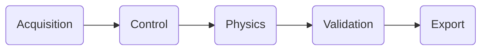
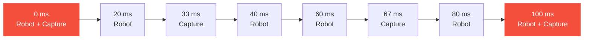

# Time Runners

A time runner is a fixed-rate clock. It steps at a set frequency, measured in hertz, and
drives the callbacks and subsystems bound to it. A runner at 50 Hz steps every 20 ms, and
each of its steps has a fixed `ts` of 0.02 seconds.

!!! abstract "In short"
    Runners do not run on separate clocks. They share one timeline, and where their steps
    coincide they run together as a **shared step**, interleaved by phase and priority.

## The default runners

A scene can hold up to eight runners. A new scene starts with two:

| Runner | Frequency | Step | Default load |
|--------|:---------:|:----:|--------------|
| :material-robot: **Robot** (Runner 0)   | 50 Hz | 20 ms   | Every script callback and built-in subsystem |
| :material-camera: **Capture** (Runner 1) | 30 Hz | 33.3 ms | Empty, available for work that runs at a different rate |

Because everything starts on Robot, the lifecycle callbacks enabled by default, `OnUpdate`
and `OnLateUpdate`, both run at 50 Hz.

## What decides when a callback runs

Three settings position each callback, alongside the scene-wide [time mode](#time-mode):

-   :material-clock-fast: **Runner**

    Sets how often the callback runs. The runner's frequency is its step rate.

-   :material-sort-variant: **Phase**

    Sets where the callback runs within a step. Phases always run in the same order.

-   :material-priority-high: **Priority**

    Orders callbacks that share a phase. A lower number runs first.

Every step runs the five phases in order:

Within each phase, that phase's callbacks run in priority order.

## A shared timeline

The engine advances every runner along one timeline.

When two or more runners land on a boundary at the same moment, they run together as a
**shared step**.

The Robot and Capture runners share a boundary every 100 ms, a rate of 10 Hz. One full
cycle looks like this:

The red boundaries are shared steps, where both runners fire together. On every other
boundary a single runner fires alone.

## Interleaving on a shared step

On a shared step the callbacks do not run one whole runner after another. They interleave
by phase. Each phase runs that phase's callbacks from every stepping runner together, in
priority order, before the next phase begins.

!!! example "On the 100 ms shared step, with a controller on Robot and a recorder on Capture"
    1. **Control** runs Robot's `OnUpdate` (priority -200), then the Capture recorder.
    2. **Physics** runs the physics callbacks from both runners.
    3. **Validation** runs Robot's `OnLateUpdate`.

    The recorder is ordered after the controller by priority, so it captures the value the
    controller just wrote.

!!! note "`ts` is always the runner's own step"
    Each callback receives its own runner's step as `ts`. A Robot callback receives `0.02`
    seconds and a Capture callback receives `0.033` seconds, even when they run on the same
    shared step.

## Time mode

The time mode sets how the shared timeline advances relative to the wall clock.

<table>
  <thead>
    <tr>
      <th>Mode</th>
      <th>How it advances</th>
      <th>Suitable for</th>
    </tr>
  </thead>
  <tbody>
    <tr style="background: rgba(76, 175, 80, 0.15);">
      <td><strong>Sim Realtime</strong> (deterministic, capped)</td>
      <td>Deterministically, never ahead of real time. Slows down rather than skipping steps under load.</td>
      <td>Simulation / Robotics</td>
    </tr>
    <tr>
      <td><strong>Sim High Performance</strong> (deterministic, uncapped)</td>
      <td>Deterministically, as fast as the hardware allows, without tracking real time.</td>
      <td>Simulation / Robotics</td>
    </tr>
    <tr>
      <td><strong>Game Realtime</strong> (non-deterministic)</td>
      <td>Follows the real-time clock and skips simulation time under load.</td>
      <td>Games</td>
    </tr>
  </tbody>
</table>

!!! tip "Determinism"
    A deterministic mode produces the same sequence of steps regardless of frame rate,
    which matters for reproducible simulation and data collection.

## Configuring runners

Runners are configured per scene, in the editor's scene settings.

| Settings page | Purpose |
|---------------|---------|
| **Time Runners** | Add, remove, and rename runners, and set their frequencies. Up to eight. |
| **Scripts** | Bind each lifecycle callback to a runner and a phase, set its priority, and toggle it. |
| **Subsystems** / **Physics** | Bind the engine's own systems, such as animation, audio, and the physics solvers. |
| **Execution Order** | View every system in its resolved order, with its phase, priority, runner, and frequency. |

Binding a callback to a runner at a different frequency changes how often it runs, with no
code change. The `ts` it receives always matches its runner's step.
