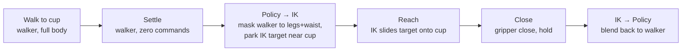

# Controlling robots: policies and IK

`RobotControllerComponent` is where robot control lives. It hosts two control surfaces in
one component: a list of **policy slots** that bind trained policies to the robot, and a
single **motion graph** that drives IK targets. Most real scenes combine both — a policy
drives the lower body, IK drives an arm, and a joint-ownership mask keeps them out of
each other's way.

The worked example throughout this page is a G1 humanoid carrying multiple policies
and an arm IK chain: a walker policy for gait, a rotator policy for clean turn-in-place,
and motion-graph IK for arm reach and grasp.

## The two API surfaces

| Surface | Type | Use for |
|---------|------|---------|
| `RobotControllerComponent` | The engine component | Motion-graph inputs (`SetInputVector3`, `SetInputTrigger`), and the raw `uint` policy API |
| `RobotController` | Typed struct wrapper, implicit conversion from the component | Policy commands with named enums (`SetPolicyActive`, `SetFloat`, `SetDrivenJoints`) |

A typical setup caches one of each in `OnCreate`:

```csharp
private RobotControllerComponent? m_Rcc;
private RobotController           m_Robot;

protected override void OnCreate()
{
    m_Rcc = GetComponent<RobotControllerComponent>();
    if (m_Rcc is null)
        return;
    m_Robot = m_Rcc;   // implicit RobotControllerComponent -> RobotController
}
```

The two fields look at the same underlying component. `m_Rcc` is used for motion-graph
inputs, `m_Robot` for typed policy commands.

## Activating and driving a policy

Two calls drive every policy: `SetPolicyActive` and `SetFloat`. The slot ID comes from
the `PolicyIds` enum the editor generates; the command ID comes from a matching command
enum (for example `WalkerCommands.SetVx`, `SetVy`, `SetYawRate`).

```csharp
using Hazel;

public class WalkerDriver : Entity
{
    private RobotControllerComponent? m_Rcc;
    private RobotController           m_Robot;

    protected override void OnCreate()
    {
        m_Rcc = GetComponent<RobotControllerComponent>();
        if (m_Rcc is null)
            return;
        m_Robot = m_Rcc;

        m_Robot.SetPolicyActive(PolicyIds.Walker, true);
    }

    protected override void OnUpdate(float ts)
    {
        if (m_Rcc is null)
            return;

        m_Robot.SetFloat(PolicyIds.Walker, WalkerCommands.SetVx,      0.5f);  // m/s
        m_Robot.SetFloat(PolicyIds.Walker, WalkerCommands.SetVy,      0.0f);  // m/s
        m_Robot.SetFloat(PolicyIds.Walker, WalkerCommands.SetYawRate, 0.0f);  // rad/s
    }
}
```

The raw `uint` form `m_Rcc.SetFloat(slotId, commandId, value)` is still there for code
that hasn't picked up the generated enums yet. New code should prefer the typed form.

## Switching between policies

A robot can carry several trained policies and swap between them. The walker handles
gait; the rotator is trained to turn cleanly in place from a standstill, which the
walker is not. A turn-to-face routine deactivates the walker, activates the rotator,
sends a yaw-rate command, then swaps back when the heading is aligned:

```csharp
// Walker -> Rotator handoff
m_Robot.SetFloat(PolicyIds.Walker, WalkerCommands.SetVx,      0.0f);
m_Robot.SetFloat(PolicyIds.Walker, WalkerCommands.SetYawRate, 0.0f);
m_Robot.SetPolicyActive(PolicyIds.Walker,  false);
m_Robot.SetPolicyActive(PolicyIds.Rotator, true);
m_Robot.SetFloat(PolicyIds.Rotator, RotatorCommands.SetYawRate, yawRate);

// Rotator -> Walker handoff (after the target heading is reached)
m_Robot.SetFloat(PolicyIds.Rotator, RotatorCommands.SetYawRate, 0.0f);
m_Robot.SetPolicyActive(PolicyIds.Rotator, false);
m_Robot.SetPolicyActive(PolicyIds.Walker,  true);
```

!!! tip "Two things to know about handoffs"
    - **Zero the outgoing policy's commands first.** Residual command values from the
      previous slot can still influence the body for a step or two as observation
      buffers feed forward. `SetFloat(...0)` before the swap gives a clean handoff.
    - **Let the body settle when the new policy was trained for a standstill start.**
      The rotator stumbles if asked to take over while the walker still has forward
      velocity. Zero the walker, wait a tick, then activate the rotator.

## Joint ownership

When two control surfaces want different joints, declare which joints each is allowed
to write. `SetDrivenJoints` takes a string array per policy slot; empty means "all
actuated joints," a non-empty list is an explicit whitelist.

```csharp
private static readonly string[] s_LegsAndWaistJoints =
{
    "left_hip_pitch",  "left_hip_roll",  "left_hip_yaw",  "left_knee",
    "right_hip_pitch", "right_hip_roll", "right_hip_yaw", "right_knee",
    "waist_yaw"
};

// Restrict the walker to legs and waist while the IK chain drives the active arm.
m_Robot.SetDrivenJoints(PolicyIds.Walker, s_LegsAndWaistJoints);
```

A walking-and-reaching scene switches the mask each phase: full-body walker when no
arm is extended, legs-and-waist when one arm is on IK, legs-and-one-arm when one arm
carries something and the other is reaching for something new. The mask is what keeps
the policy from fighting the IK over shared joints.

## Driving IK targets

The motion graph runs every step on a robot that has one attached. Scripts talk to it
by writing **named inputs** declared in the `.hmograph` asset, addressed through cached
`Identifier` keys.

For a humanoid with two-arm IK, the conventional input names are `Left_Target`,
`Left_Target_Orientation`, `Right_Target`, `Right_Target_Orientation`:

```csharp
public class ArmIK : Entity
{
    private static readonly Identifier s_LeftTarget      = new Identifier("Left_Target");
    private static readonly Identifier s_LeftOrientation = new Identifier("Left_Target_Orientation");

    private RobotControllerComponent? m_Rcc;

    protected override void OnCreate()
    {
        m_Rcc = GetComponent<RobotControllerComponent>();
    }

    public void SetLeftArmTarget(Vector3 worldPosition, Vector3 eulerRadians)
    {
        if (m_Rcc is null)
            return;

        m_Rcc.SetInputVector3(s_LeftTarget,      worldPosition);
        m_Rcc.SetInputVector3(s_LeftOrientation, eulerRadians * Mathf.Rad2Deg);
    }
}
```

Positions are in metres, world space. Orientations are in degrees (motion-graph inputs
expect degrees, so the script applies `Mathf.Rad2Deg` at the boundary). Cache the
`Identifier` instances in `static readonly` fields; they are not free to construct
every frame.

Input names are robot-specific. A single-arm robot's graph might expose
`Target_Position` and `Target_Orientation`; a bimanual graph exposes `Left_*` and
`Right_*`; some graphs also expose elbow-pole inputs (`Left_Pole_Target`,
`Left_Pole_Weight`) to lock the elbow into the desired IK branch. Open the motion
graph in the editor to see exactly which inputs are wired.

## The combined pattern: walk and reach

A walk-and-pickup cycle on a humanoid is the canonical walker + IK combination,
structured as a sequence of phases:



The state the controller carries through this is small: the active arm (left or right),
the target's world position, the current IK target, and a phase flag. The walker keeps
the body upright through every phase; the IK only takes over the active arm; the joint
mask keeps them sharing the body without fighting.

## Where to go next

- The editor-side view in
  [Robots → Adding policies and motion graphs](../../robots.md#adding-policies-and-motion-graphs)
  covers the Add Policy context menu and what the `RobotControllerComponent` Inspector
  shows.
- [Working with components → Mujoco bodies](../getting-started/working-with-components.md#mujoco-bodies-robotics)
  has the script-level surface for the Mujoco component family.
- [Getting started](../getting-started/index.md) has the minimal WASD walker driver as
  a stripped-down version of the policy patterns above.
