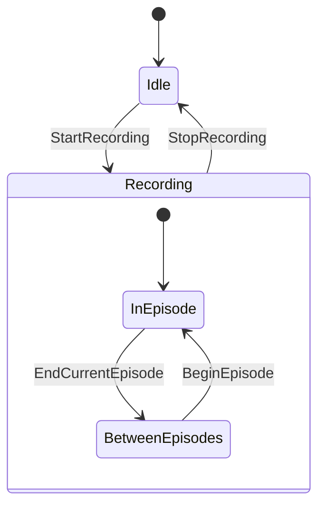

# Recording with the Observer

The Observer is the engine's data-recording system. It captures robot state, actions,
contact events, and camera frames during a simulation run, and writes them to disk as a
structured dataset (Parquet by default, with video files alongside). Scripts drive the
recording lifecycle through `Hazel.Data.Observer`, a small static API.

!!! abstract "In short"
    Call `Observer.StartRecording()` to begin a session, `Observer.EndCurrentEpisode(success)`
    to close an episode (a new one starts automatically), and `Observer.StopRecording()`
    to finish. Everything else is configured in the scene's Recorder settings.

## The session lifecycle

A recording is organised as one **session** containing one or more **episodes**. The
session writes everything into a single `DataSessions/<timestamp>/` folder. Each episode
is one trajectory within that session.



`StartRecording()` opens the session and the first episode in one call.
`EndCurrentEpisode(success)` closes the current trajectory; in normal use the session
immediately starts the next one on the following step. `BeginEpisode()` opens the next
episode explicitly after a manual end. `StopRecording()`, or hitting the configured
`TotalEpisodes` target, returns the session to Idle.

`Observer.IsRecording` is `true` for the whole **Recording** state, in or between
episodes, and `false` in **Idle**.

!!! note "`EndCurrentEpisodeBeginNext(success)`"
    Atomic shortcut: ends the current episode and begins the next one in one call. Leaves
    the diagram unchanged (no detour through **BetweenEpisodes**), so it is the cleanest
    way to mark an episode boundary when the script does not want the brief gap.

## The Observer API

Every member is static on `Hazel.Data.Observer`:

| Member | What it does |
|--------|--------------|
| `StartRecording()` | Opens a session. Authenticates to LuckyHub, creates the `DataSessions/<timestamp>/` folder, and begins the first episode. Blocks briefly while authenticating. |
| `StopRecording()` | Closes the session. Flushes buffered frames, finalises the video encoders, and submits episode metadata to LuckyHub. |
| `IsRecording` | `true` while a session is open. |
| `BeginEpisode()` | Starts a new episode within an active session. Rarely called directly; episodes auto-start after `EndCurrentEpisode`. |
| `EndCurrentEpisode(bool success)` | Closes the current episode. If `success` is `false` and `EnableDiscardFailedEpisodes` is set in the scene settings, the episode is moved to a `.failed/` folder instead of being kept. |
| `EndCurrentEpisodeBeginNext(bool success)` | Closes the current episode and opens the next in one call. Equivalent to `EndCurrentEpisode` followed by `BeginEpisode`. |
| `RegisterTask(int index, string description)` | Declares a sub-task label. Call once per task type at startup. |
| `SetCurrentTaskIndex(int index)` | Sets which registered task is currently running. Every recorded frame from this call onward is tagged with the task index. |

## Common patterns

### Bracket a single task

The simplest pattern: start recording when the task begins, stop when it finishes. Useful
when one script orchestrates a single trajectory.

```csharp
using Hazel;
using Hazel.Data;

public class TaskRecorder : Entity
{
    [Button("Start recording")]
    public void Start()
    {
        Observer.StartRecording();
        Log.Info("Recording started");
    }

    [Button("End episode (success)")]
    public void Succeed()
    {
        Observer.EndCurrentEpisode(true);
    }

    [Button("End episode (failure)")]
    public void Fail()
    {
        Observer.EndCurrentEpisode(false);
    }

    [Button("Stop recording")]
    public void Stop()
    {
        Observer.StopRecording();
        Log.Info("Recording stopped");
    }
}
```

The `[Button]` attributes make each call clickable from the Inspector at runtime, which
is the quickest way to drive recording from a controller script during scene testing.

### Run a batch of episodes

For data collection, scripts usually start the session once, then mark episode boundaries
as the simulator resets between trajectories.

```csharp
using Hazel;
using Hazel.Data;

public class EpisodeRunner : Entity
{
    [Tooltip("How many episodes to record before stopping.")]
    public int EpisodeCount = 100;

    private int m_Completed = 0;

    protected override void OnCreate()
    {
        Observer.StartRecording();
    }

    // Call this from the task logic when an episode finishes.
    public void OnEpisodeFinished(bool success)
    {
        Observer.EndCurrentEpisode(success);
        m_Completed += 1;

        if (m_Completed >= EpisodeCount)
            Observer.StopRecording();
    }
}
```

!!! note "Scene-level episode cap"
    The scene itself has a **Total Episodes** setting that defaults to **300** and is
    enforced by the recorder. Once `CurrentEpisodeIndex` reaches it the Observer
    stops the session on its own, even if the script's own `EpisodeCount` is higher.
    To record more than 300, raise it in **Settings → Data → Session → Episodes →
    Total Episodes** (the slider goes up to 1000). Setting it to `0` disables the cap
    entirely, leaving only the script's `StopRecording()` to end the session.

### Label sub-tasks within an episode

For episodes with multiple phases (approach, grasp, place), register a task per phase at
startup and switch index as the phase changes. Every recorded frame is tagged with the
current task index, so downstream tooling can slice the dataset by phase.

```csharp
using Hazel;
using Hazel.Data;

public class PickAndPlaceLabeller : Entity
{
    private const int k_TaskApproach = 0;
    private const int k_TaskGrasp    = 1;
    private const int k_TaskPlace    = 2;

    protected override void OnCreate()
    {
        Observer.RegisterTask(k_TaskApproach, "approach");
        Observer.RegisterTask(k_TaskGrasp,    "grasp");
        Observer.RegisterTask(k_TaskPlace,    "place");

        Observer.SetCurrentTaskIndex(k_TaskApproach);
    }

    // Call as the task graph transitions between phases.
    public void EnterGraspPhase() => Observer.SetCurrentTaskIndex(k_TaskGrasp);
    public void EnterPlacePhase() => Observer.SetCurrentTaskIndex(k_TaskPlace);
}
```

## What gets recorded

Three recorder modes capture different sets of state. The mode is set on the scene's
Recorder settings page, not from script.

<div class="grid cards" markdown>

-   :material-robot-industrial: **Robot Arm**

    Joint angles, gripper state, end-effector pose, and contact forces. The default mode
    for single-arm manipulation tasks (Piper, SO100, OpenArm).

-   :material-robot: **MuJoCo Full Scene**

    Every MuJoCo body, joint, contact, and actuator in the scene. Use for whole-body
    humanoid work (G1) and multi-agent scenarios.

-   :material-quadcopter: **Drone**

    Position, orientation, rotor speeds, and IMU readings. For quadrotor and aerial
    tasks.

</div>

Alongside the state stream, the Recorder page configures the **camera bindings**:
which scene cameras record video, at what resolution, and to which output names.
Optional semantic-segmentation masks ride alongside the colour frames when enabled.

!!! note "The recorder rate is independent of the control loop"
    The Observer runs on its **own recorder time runner**, at the data and video rates set in
    the Recorder settings (30 Hz by default). That rate is **decoupled from how fast the
    simulation is stepped**. Whether a gRPC client is driving the action gate flat out in
    `DETERMINISTIC_HIGH_PERF` or the scene is just playing on its own, recording happens at
    the configured rate. Any run can be recorded, at any time, at any rate.

    This is also the difference from the gRPC `Step` API's `camera_requests`: those render a
    single frame *per step* as a policy **observation**, not a recording (see
    [gRPC API → Recording vs. observation frames](../../grpc-api.md#recording-vs-observation-frames)).
    The Observer is what actually **records**. Use it for datasets and video, never the
    per-step observation frames.

## Output

A session writes one folder under `DataSessions/`:

```
DataSessions/session_<timestamp>/
├── meta/        info.json, stats.json, tasks.parquet, episode metadata
├── data/        per-episode state and action frames (.parquet)
└── videos/      one folder per camera, encoded video files
```

The frame schema is standardised across modes. Every frame carries `episode_index`,
`frame_index`, `timestamp`, `task_index`, and the action and observation vectors for the
configured mode.

## Caveats

!!! warning "Things to know"
    - **Recording does not start automatically.** A script must call
      `Observer.StartRecording()`. Nothing is captured before that.
    - **The scene's Recorder must be enabled.** If the Recorder runner is disabled in
      scene settings, `StartRecording()` quietly bails out.
    - **`StartRecording()` blocks briefly** while authenticating with LuckyHub and
      creating a remote task entry. Expect tens to hundreds of milliseconds.
    - **Recording pauses when the simulation pauses.** Pausing the engine stops the
      recorder; unpausing resumes it. The current episode stays open across the pause.
    - **Episodes auto-advance.** After `EndCurrentEpisode`, the next episode begins on
      the next step without a `BeginEpisode` call. To stop, call `StopRecording`.
    - **Hitting `TotalEpisodes` stops the session automatically.** The configured target
      is a hard cap; the session returns to idle once it is reached.

!!! tip "Where to configure the rest"
    Output directory, recorder mode, total episode count, max episode duration, camera
    bindings, codec and resolution all live in the scene's **Recorder** settings page,
    not in script. Scripts drive the lifecycle; the scene defines what to capture.
