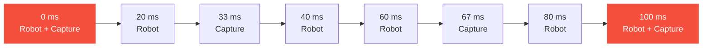

# The Time Manager

Lucky Engine's Time Manager is the conductor of the simulation. It decides what runs,
when, and at what rate, so every physics solver, script callback, and engine subsystem
in a scene advances on one shared clock instead of fighting each other.

One instance lives on every `Scene`.

!!! abstract "In short"
    The Time Manager runs up to eight fixed-rate clocks on one timeline, sequences five
    execution phases per simulation step, and steers the whole thing inside a CPU budget
    so the UI stays responsive. The script-side view is at
    [Time Runners](scripting/getting-started/time-runners.md).

## What it does

- **Advances the simulation.** Each rendered frame, the Time Manager runs zero or more
  simulation steps until the work for that frame is done.
- **Coordinates multiple rates.** Different subsystems often want different rates:
  control at 50 Hz, recording at 30 Hz, drone sensors at 500 Hz, with lidar faster
  still. Each binds to a runner; runners share one timeline so their boundaries line up.
- **Enforces phase order.** Within a step, work is divided into five fixed phases.
  Callbacks register with a phase and a priority; the order they run in is decided once
  and replayed every step.

## Time modes

<div class="grid cards" markdown>

-   :material-clock-outline: **Sim Realtime** (deterministic, capped)

    Steps every runner deterministically and never runs ahead of the wall clock. Slows
    down rather than skipping steps under load. The default.

-   :material-rocket-launch: **Sim High Performance** (deterministic, uncapped)

    Steps every runner deterministically and as fast as the hardware allows, without
    tracking real time. For headless replay, training, and benchmarks.

-   :material-controller-classic: **Game Realtime** (non-deterministic)

    Follows the real-time clock and skips simulation time when the machine cannot keep
    up. The legacy game-loop behaviour.

</div>

A deterministic mode produces the same sequence of steps regardless of frame rate, which
is what makes reproducible simulation and data collection possible.

## Default runners

A new scene starts with two runners. Up to eight can be added.

<div class="grid cards" markdown>

-   :material-robot: **Robot**

    Runner 0, **50 Hz**, 20 ms step.

    Every script callback and built-in subsystem runs on Robot by default.

-   :material-camera: **Capture**

    Runner 1, **30 Hz**, 33.3 ms step.

    Available for slower work like data recording or low-rate sensor exports.

</div>

For frequencies that do not divide evenly into nanoseconds (30 Hz, 60 Hz), the engine
internally cycles the step duration so long-term timing stays exact. Shared boundaries
between runners therefore coincide to the nanosecond.

## Phases

Every simulation step walks through five phases in order:


| Phase | What runs |
|-------|-----------|
| **1. Acquisition** | Sensor reads, data recorder, sync points, `OnPreUpdate` |
| **2. Control**     | `OnUpdate`, robot controllers, motion-graph IK |
| **3. Physics**     | Jolt, MuJoCo, Box2D, `OnPhysicsUpdate` |
| **4. Validation**  | `OnLateUpdate`, animation |
| **5. Export**      | `OnPostUpdate`, gRPC step capture, audio scene subsystem |

A callback is bound to exactly one phase. Multiple callbacks in the same phase run in
priority order, lowest number first, with ties broken stably by registration order.

## What you can rely on

The Time Manager makes four guarantees about every simulation step:

- **All runners share one timeline.** Sim time advances by the same delta on every
  runner, every step. Runners cannot drift apart.
- **Only runners that crossed a boundary fire callbacks.** A runner whose accumulator is
  still short of its next step does nothing this iteration.
- **Phases always run in order.** Acquisition first, Export last, every step, every
  scene.
- **At a shared step, callbacks interleave by phase, then by priority.** Never one whole
  runner after the other.

## Shared steps

When two runners' boundaries fall on the same instant, the Time Manager runs them
together. Phases still drive the order; the runners' callbacks merge within each phase
in priority order.

For the default Robot (50 Hz) and Capture (30 Hz), the shared boundary rate is the GCD
of their frequencies: **10 Hz**. Every 100 ms both runners land together:



This is the cadence at which the engine's sync-point subsystem latches consistent
snapshots across rates.

!!! note "A familiar analogy"
    The multi-rate, nanosecond-aligned behaviour matches synchronised clock domains in
    digital hardware: several clocks derived from one base clock realign at their common
    beat and advance edge to edge. A multi-rate fixed-step solver, such as Simulink,
    schedules different sample rates on a shared base step the same way.

## The step context

Every callback receives a `StepContext` with three pieces of information:

```cpp
struct StepContext
{
    std::chrono::nanoseconds dt;     // this runner's fixed step
    RunnerID                 id;     // which runner is firing the callback
    const std::array<RunnerState, k_MaxRunners>* Swarm;  // every runner's live state
};
```

The **swarm** is the bridge between rates. Each entry carries one runner's current fixed
step and its forward-looking alpha, an accumulator fraction in `[0, 1]` toward the next
boundary. A callback can read another runner's state to interpolate between fixed steps
or align a slower read with a faster producer:

```cpp
double rendererAlpha  = ctx.GetAlpha(physicsRunnerID);   // interpolate between physics steps
auto   controllerStep = ctx.GetStep(controlRunnerID);    // align with the controller's clock
```

## Free updates

Two phases sit outside the simulation clock: `OnFreePreUpdate` runs before any simulation
step in a frame, and `OnFreePostUpdate` runs after. Their `ts` is the rendered-frame
delta, not a fixed step. They are disabled by default and exist for work that genuinely
belongs on the refresh rate, typically renderer hooks or UI bookkeeping.

For the script-author's view of the same system, including runner names, phase ordering
as the script sees it, and the scene-settings editor pages, see
[Time Runners](scripting/getting-started/time-runners.md) in the Scripting guide.
